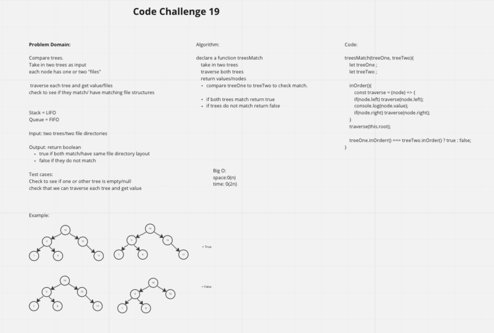

# Code Challenge

Check to see if two trees match nodes/leaf/ file directory.

## 

### Problem Domain

* Compare trees.

* Take in two trees as input

* each node has one or two "files"

  *traverse each tree and get value/files

  *check to see if they match/ have matching file
    structures

Stack = LIFO
Queue = FIFO

#### Input

* two trees/two file directories

#### Output

*return boolean

* true if both match/have same file directory layout

* false if they do not match

#### Test cases

* Check to see if one or other tree is empty/null

* Check that we can traverse each tree and get value

#### Example

#### Algorithm

* declare a function treesMatch
  *take in two trees
  * traverse both trees
  *return values/nodes
*compare treeOne to treeTwo to check match.

* if both trees match return true
* if trees do not match return false

#### Big O

space:0(n)
time: 0(2n)

#### Code / PsuedoCode

treesMatch = (treeOne, treeTwo) => {
 let treeOne ;
 let treeTwo ;

 inOrder(){
  const traverse = (node) => {
  if(node.left) traverse(node.left);
  console.log(node.value);
  if(node.right) traverse(node.right);
 }
 traverse(this.root);

 treeOne.inOrderr() === treeTwo.inOrder() ? true : false;
}
