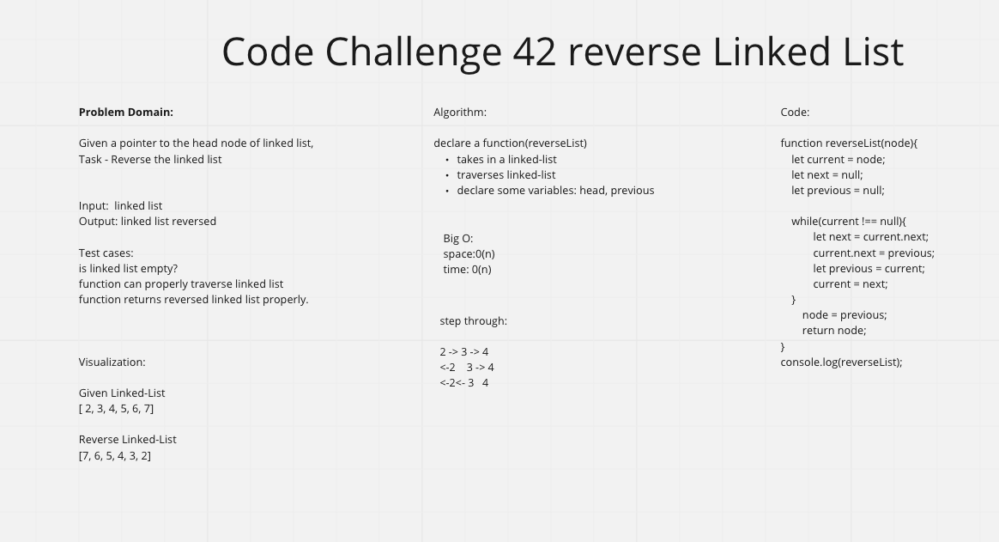

# Code Challenge 42

## 

## Approach

I chose to traverse the linked list and set/ update the variables at each position. I delcared my reverseList function that takes in a node(head). I initially set current to node; and next and previous are initially set to null. My while loop resembles a caterpiller; as we traverse the list:

* next becomes current.next
* current.next is set to previous
* prvious is set to current
* current is set to next

 This is switching the direction(reversing) the linked-list in place.
 Big O:
 time: O(n)
 space: O(n)

I worked on this on my own. It was good to review this and try to see if I have made progress. I need more practice traversing data structures and understanding how and when to use variables and other data structures to aid in these different code challenges.
