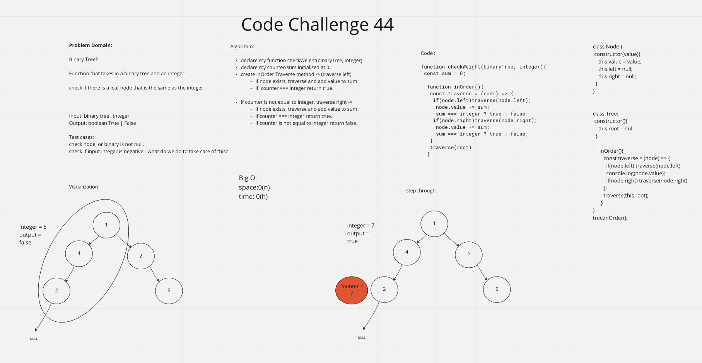

# Code Challenge 44

## Create a function that takes in a binary tree and an integer; and checks if there is a leaf node with a weight that matches the given integer.

## 

I decided to take another try at my interview whiteboard code challenge that I failed. I am practicing to hopefully bridge the gaps currently holding me back. I feel like I understand the concepts, but still get stuck on creating working algorithms and code that are coherent and build off each other.
