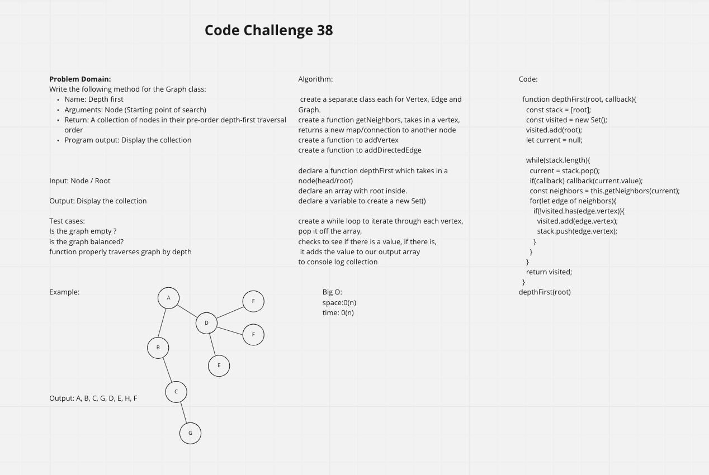

# Code Challenge 38 Graph-Depth-First

## Challenge: Extending an Implementation

Write the following method for the Graph class:

Name: Depth first

* Arguments: Node (Starting point of
    search)

* Return: A collection of nodes in
    their pre-order depth-first traversal order

Program output: Display the collection

## Approach & Efficiency

## Solution

<!-- ## Requirements
Ensure your complete solution follows the standard requirements.

1. Write [unit tests](../../Challenge_Testing){:target="_blank"}
1. Follow the [template for a well-formatted README](../../Challenge_Documentation){:target="_blank"}
1. Submit the assignment following [these instructions](../../Challenge_Submission){:target="_blank"} -->
