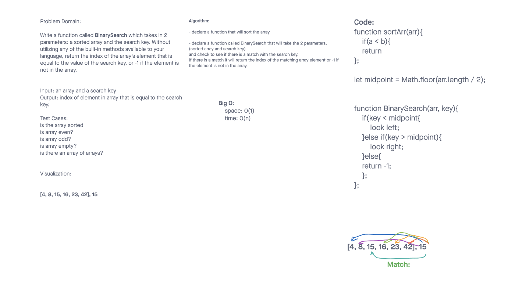

# Binary Search of Sorted Array

Write a function called **BinarySearch** which takes in 2 parameters: a sorted array and the search key. Without utilizing any of the built-in methods available to your language, return the index of the array’s element that is equal to the value of the search key, or -1 if the element is not in the array.

## Whiteboard Process

## Approach & Efficiency

We created a function to find the midpoint. Then checked to see if the key is less than the midpoint. If less than, we look to the beginning/start to midpoint of the array. If greater than, we look from mid point to end of array. Repeat until key match is found.

- declare a function that will sort the array

- declare a function called BinarySearch that will take the 2 parameters, (sorted array and search key)
and check to see if there is a match with the search key.

- If there is a match it will return the index of the matching array element or -1 if the element is not in the array.
