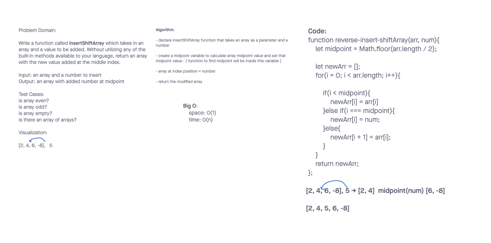

# Insert to Middle of an Array

Write a function called insertShiftArray which takes in an array and a value to be added. Without utilizing any of the built-in methods available to your language, return an array with the new value added at the middle index.

## Whiteboard Process

## Approach & Efficiency

We started by creating a function to find the midpoint and setting it to the midpoint variable. We then used a for loop to iterate through the values of the arr. We then created an if/else statement; if they are less than the midpoint, it is added to new array. Then else if it matches our midpoint input(num), input(num) is added to the new array. Then else add to new array.
 