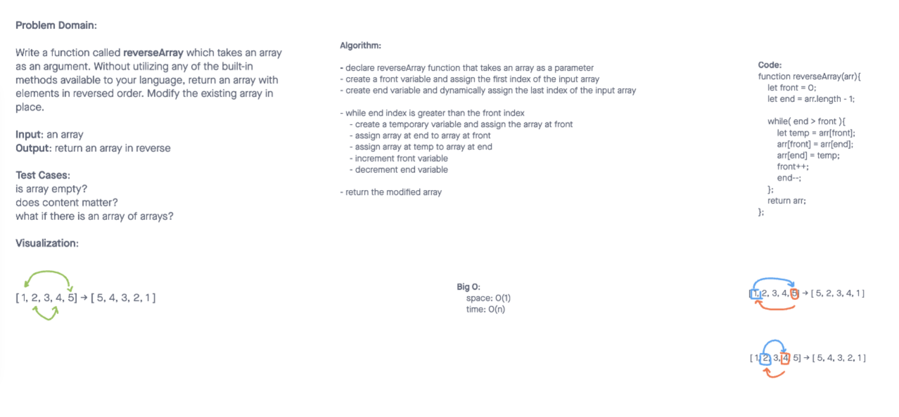

# Reverse an Array

Write a function called **reverseArray** which takes an array as an argument. Without utilizing any of the built-in methods available to your language, return an array with elements in reversed order.

## Whiteboard Process

## Approach & Efficiency

We started by creating temporary variables we could use with the values in a given array. Using a while loop we can check to see what values are greater; the front or the end variable (depends on their index position). We can then increment and decrement by 1 respectively on our variables to go to the next set or indexes. Once the while loop is complete, we should be able to return the array in place in reverse order. The space is each index, (front, end) that is inside of the given array. The time is dependent on the size of the array, i.e. how many indexes there are to loop through.
