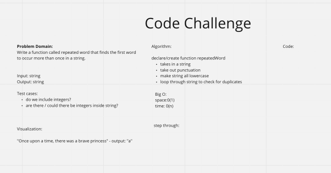

# Challenge Summary

#### Feature Tasks

* Write a function called repeated word that finds the first word to occur more than once in a string

  * Arguments: string

  * Return: string

## Whiteboard Process

## Solution

[Solution](./hashmap-repeated-word.js)
