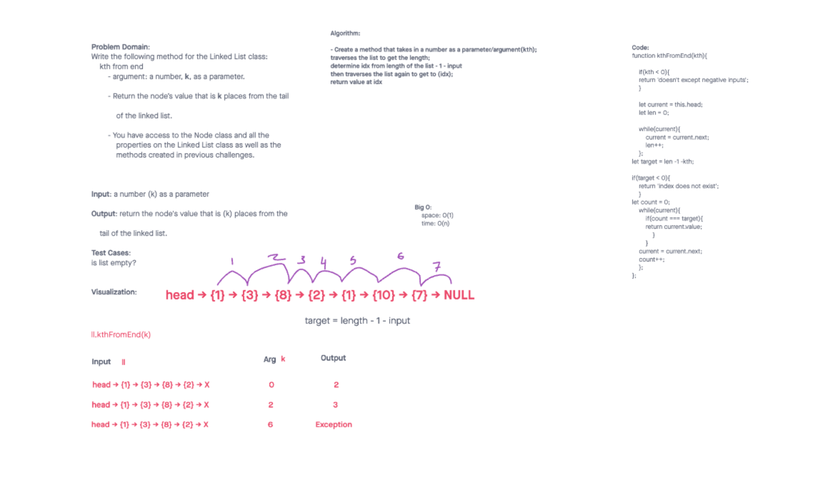

# Singly Linked List / Linked-list-kth

Create a Linked List class
Within your Linked List class, include a head property.
Upon instantiation, an empty Linked List should be created.

## Challenge

Write the following method for the Linked List class:

kth from end
argument: a number, k, as a parameter.
Return the node’s value that is k places from the tail of the linked list.
You have access to the Node class and all the properties on the Linked List class as well as the methods created in previous challenges.

### Previous tasks

The class should contain the following methods:

#### Insert

  Arguments: value
  Returns: nothing
  Adds a new node with that value to the head of the list with an O(1) Time performance.

#### Includes

  Arguments: value
  Returns: Boolean
  Indicates whether that value exists as a Node’s value somewhere within the list.

#### To string

  Arguments: none
  Returns: a string representing all the values in the Linked List, formatted as:
  "{ a } -> { b } -> { c } -> NULL"

#### Append

  Arguments: new value
  adds a new node with the given value to the end of the list

#### Insert before

  Arguments: value, new value
  adds a new node with the given new value immediately before the first node that has the value specified

#### Insert after

  Arguments: value, new value
  adds a new node with the given new value immediately after the first node that has the value specified

## Approach & Efficiency

I used while loops to iterate through the list(s) and added or changed dependent on each feature.

## API

Insert:
  Arguments: value
  Returns: nothing
  Adds a new node with that value to the head of the list with an O(1) Time performance.

Includes:
  Arguments: value
  Returns: Boolean
  Indicates whether that value exists as a Node’s value somewhere within the list.

To string
  Arguments: none
  Returns: a string representing all the values in the Linked List, formatted as:
  "{ a } -> { b } -> { c } -> NULL"

Append:
  Arguments: value
  Returns: nothing
    Adds a new node with that value to the end of the list with an O(n) Time performance.
