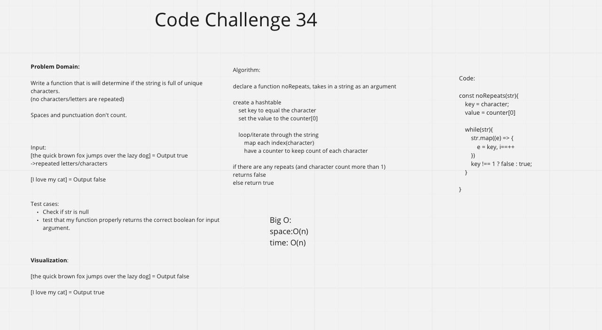

# Code Challenge 34 - noRepeats

## Problem Domain

Write a function that will determine if the string is full of unique characters. (no repeated letters)

### Solution

### Step through process

We create a hashmap to store our key | value pairs. The key will be set to character[i], value will be a counter set to 0 to start. We create a while loop when input(str) exists, we iterate through and map each key and update the counter. If any counter is not 1, we return false, else we return true.
