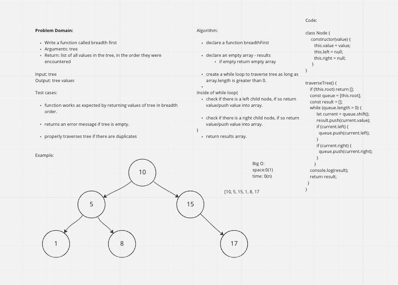

# Challenge Summary

Breadth-first Traversal.

## Whiteboard Process

## Approach & Efficiency

* Declare a function breadthFirst

* Declare an empty array - results
  if empty return empty array

* Create a while loop to traverse tree as long as array.length is greater than 0.

  * Inside of while loop{
      check if there is a left child node, if so return value/push value into array.

    check if there is a right child node, if so return value/push value into array.
    }
    return results array.
