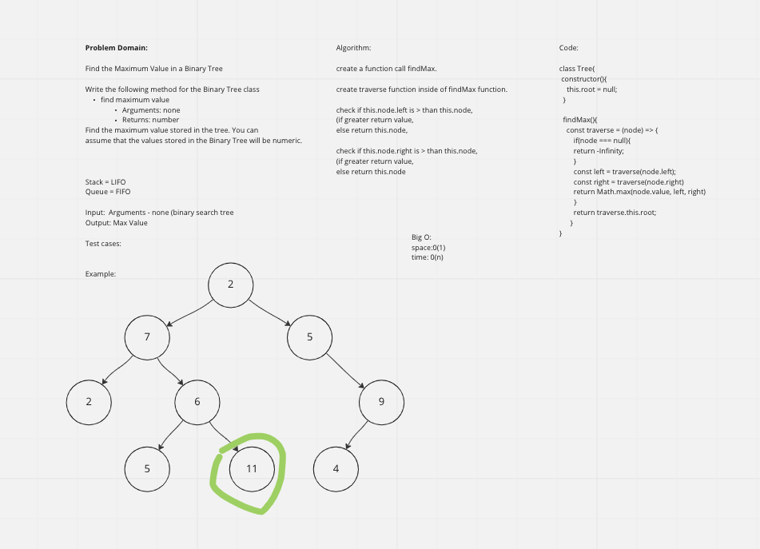

# Challenge Summary

Find the Maximum Value in a Binary Tree

## Whiteboard Process

## Approach & Efficiency

The "right node" will always be > than the parent node. Using this information, we can check "this.right" to see if it is null, if it is not, it will return our max value inside of our tree.

## Solution

We created a recursive traversal function inside of our findMax function to traverse and find the greatest value between node, node.left and node.right. Once the traversal is complete we return the final Max value inside of the tree.
